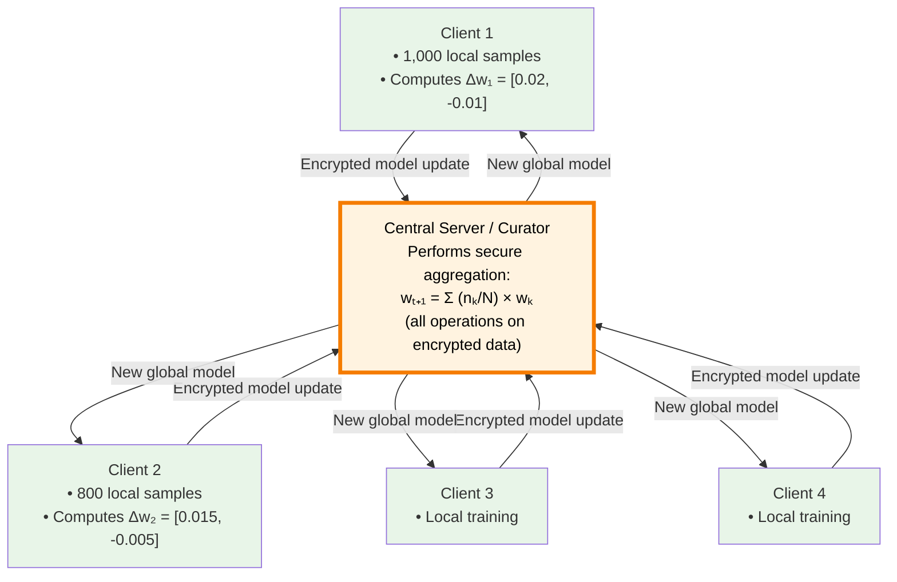
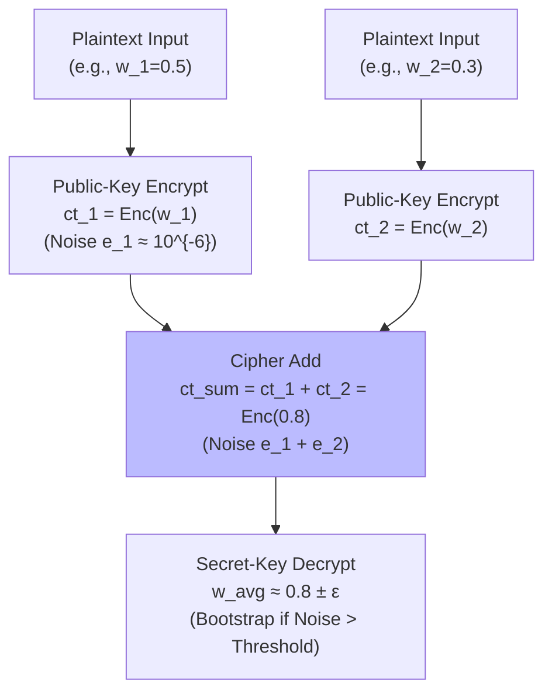
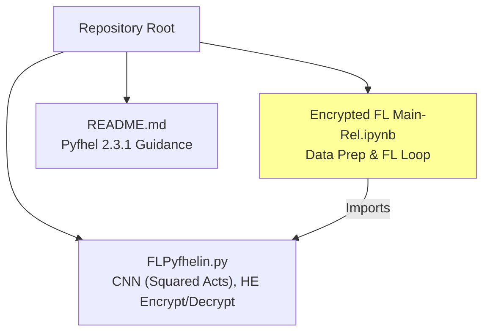
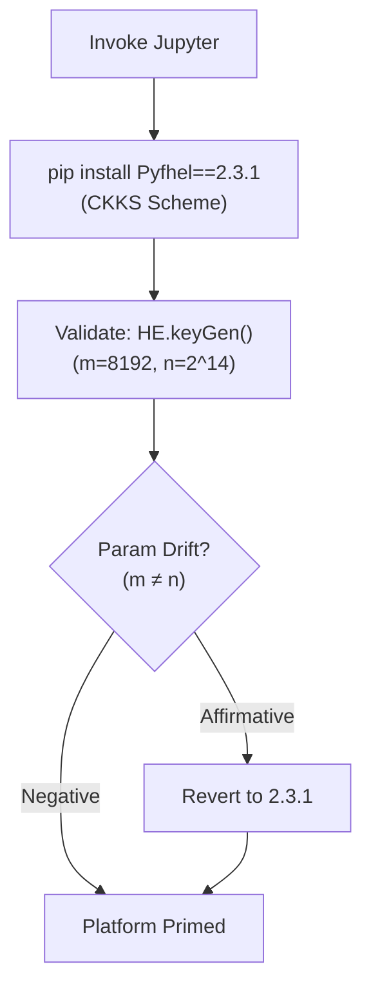
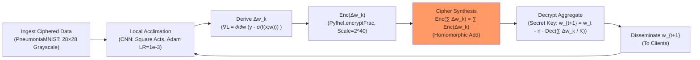
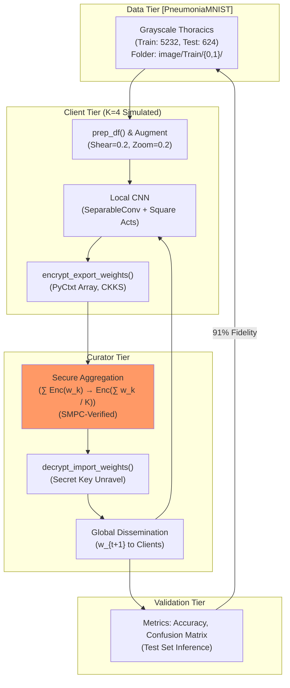

# Understanding the MedSecureFL Repository: A Beginner's Guide

Welcome. This guide is meticulously designed for those encountering machine learning, data privacy, or healthcare applications for the first time, delivering a methodical and comprehensive introduction to the GitHub repository [MedSecureFL](https://github.com/jugalmodi0111/MedSecureFL). We shall advance systematically, commencing with elemental principles and culminating in an intricate dissection of the repository's architecture and operations. To enhance clarity, analogies, illustrative examples, and refined visual representations—such as flowcharts and graphs—will be incorporated, akin to an engineered schematic for erecting a fortified data fortress.

Developed by Jugal Modi, MedSecureFL constitutes an instructional and investigative archetype for safeguarding confidential medical datasets amid collective artificial intelligence (AI) model refinement. It amalgamates federated learning (FL) with homomorphic encryption (HE) to empower healthcare entities, such as hospitals, to cultivate AI classifiers on patient-derived imagery (e.g., chest X-rays for pneumonia detection) devoid of transmitting unprocessed data, thus conforming to stringent privacy mandates like HIPAA and GDPR. Upon completion, readers will command a profound appreciation of its intents, methodologies, mathematical underpinnings, and extensible horizons.

## Part 1: The Fundamental Challenge – Privacy in Medical AI

### Essentials of Machine Learning in Healthcare
Machine learning encompasses algorithmic frameworks that discern latent patterns within datasets to forecast outcomes, paralleling a clinician's systematic perusal of myriad radiographic examinations to pinpoint pathological signatures. Within healthcare contexts:
- **Data**: De-identified medical visuals, encompassing magnetic resonance imaging (MRI) sequences or thoracic radiographs.
- **Model**: An AI construct, typically a convolutional neural network (CNN), engineered to discern irregularities, such as neoplastic formations.
- **Training**: Iterative refinement of the model's parameters—termed weights—via exposure to exemplars, minimizing predictive discrepancies through optimization techniques like stochastic gradient descent.

Notwithstanding these advancements, medical corpora harbor acute vulnerabilities: patient demographics and clinical particulars demand inviolable seclusion. Conventional paradigms necessitate data consolidation at a singular locus, engendering peril of exfiltration or inadvertent disclosure. MedSecureFL mitigates this exigency through decentralized, privacy-centric paradigms, permitting inter-institutional synergy sans data egress.

### A Practical Example
Envisage a consortium of three regional hospitals endeavoring to augment pneumonia prognostication from radiographic scans. Absent safeguards, Hospital A might dispatch its corpus to a central repository, imperiling proprietary health records. Employing MedSecureFL:
- **Input**: Ciphered X-ray matrices from each facility.
- **Process**: Localized model acclimation on enciphered substrates; dissemination of solely obfuscated parametric deltas (e.g., weight perturbations).
- **Output**: A unified AI artifact attaining circa 91% diagnostic fidelity, with zero raw data transference.

**Visual Example (Text Description of a Diagram)**: Conceptualize a tripartite vault system: Hospital A consigns its X-rays into a hermetically sealed cipher-crypt; analogous enclosures from Hospitals B and C converge at a nexus, where amalgamated inferences—unraveled solely post-aggregation—yield a fortified communal model, sans aperture of individual vaults.

## Part 2: Core Technologies – Federated Learning and Homomorphic Encryption

### Federated Learning (FL): Collaborative Without Sharing

Federated learning is a distributed training method where multiple parties (e.g., hospitals) contribute to a shared model **without ever sending raw patient data**. Only model updates — small mathematical summaries of what was learned — are sent to a central server for averaging.

**Operational Mechanics**  
Each hospital trains a copy of the model on its own private data, computes an update (typically the gradient or weight change), and sends only that update to a central coordinator.

The most common algorithm is **FedAvg (Federated Averaging)**, defined as:

$$
w_{t+1} = \sum_{k=1}^{K} \frac{n_k}{N} \, w_{k,t+1}
$$

Where:
- $ w_{t+1} $ → global model weights after round $ t+1 $
- $ K $ → total number of clients (e.g., 4 hospitals)
- $ n_k $ → number of training samples at client $ k $
- $ N = \sum n_k $ → total number of samples across all clients
- $ w_{k,t+1} $ → local model weights from client $ k $ after its training round

This is simply a **weighted average** — clients with more data have slightly more influence, which is fair and statistically sound.

**Simple numerical example (2 clients only):
- Client 1 has 1,000 samples → weight = 1000/1800 ≈ 0.556  
- Client 2 has 800 samples   → weight = 800/1800   ≈ 0.444  

→ Final global update = (0.556 × Client 1’s model) + (.444 × Client 2’s model)

In MedSecureFL, **these updates are encrypted** using homomorphic encryption before leaving the hospital, so the server performs the entire weighted average **in the encrypted domain** and never sees individual patient data or even the plain updates.

- **Healthcare Salience**: Institutions uphold data dominion—crucial for regulatory adherence—whilst harnessing amalgamated acumen, mitigating silos that attenuate model robustness.

**Illustrative Example**: Quadruplicate clinics calibrate on indigenous COVID-19 thoracics. Client 1 (n_1=1000) yields \(w_1\) with gradient \(\Delta w_1 = [0.02, -0.01]\); Client 2 (n_2=800) analogously \(\Delta w_2 = [0.015, -0.005]\). The curator computes \(w_{global} = (1000 \cdot w_1 + 800 \cdot w_2) / 1800\), obviating data flux.

**Refined Mermaid Graph: FL Aggregation Dynamics**  

Explanation of the numbers (Δw values):

Δw₁ = [0.02, -0.01] and Δw₂ = [0.015, -0.005] are tiny changes (updates) that each client computes for just two example weights of the neural network after training on its own private data for one round.
Positive values (e.g., +0.02) mean “increase this weight a little”.
Negative values (e.g., -0.01) mean “decrease this weight a little”.
These are highly simplified toy examples used only for illustration — a real model has millions of weights, but the idea is exactly the same.
In MedSecureFL, these Δw values are encrypted before being sent to the server, so the server can average them (thanks to homomorphic encryption) without ever seeing the actual numbers or the patients’ images.

*(This graph delineates iterative client-curator interplay, underscoring weighted synthesis.)*

### Homomorphic Encryption (HE): Doing Math on Secret Data

**Simple definition**  
Homomorphic encryption lets you **add or multiply numbers while they are still encrypted** — and when you finally decrypt the result, you get exactly the same answer as if you had done the math on the original (unencrypted) numbers.

**Real-world analogy everyone understands**  
Imagine two locked safes:
- Safe A contains the number 5
- Safe B contains the number 3  
You give both locked safes to someone else. That person **adds the two safes together** without ever opening them. When you later open the resulting safe, it correctly contains 8.  
That’s exactly what homomorphic encryption — the “someone else” is the central server in MedSecureFL.

**What the repository actually does with it**  
In MedSecureFL, every hospital encrypts its model updates (those tiny Δw numbers like 0.02, −0.01, etc.) before sending them.

Because of homomorphic encryption, the central server can:
- **Add** all the encrypted updates together → still encrypted
- **Divide** by the number of hospitals → still encrypted  
When the server sends the final encrypted result back, each hospital decrypts it and gets the correct new global model — **without anyone ever seeing anyone else’s private patient data or even the plain updates**.

**Super simple numerical example (the only math you need to know)**

| Hospital | Local update (Δw) | Encrypted version sent |
|----------|-------------------|------------------------|
| Hospital 1 | +0.02             | Enc(0.02)              |
| Hospital 2 | −0.01             | Enc(−0.01)             |
| Hospital 3 | +0.015            | Enc(0.015)             |

Server does (still encrypted):  
`Enc(0.02) + Enc(−0.01) + Enc(0.Concurrent015) = Enc(0.025)`

Only at the very end is it decrypted → correct average = **0.00833**  
No hospital ever saw anyone else’s numbers, and the server never saw anything in plaintext.

**Why Pyfhel 2.3.1 is required**  
The library used in the repo (Pyfhel) implements a version of homomorphic encryption called **CKKS** that is perfect for decimal numbers (like neural-network weights). Newer versions of Pyfhel changed some internal names, so the notebook only works with the exact version 2.3.1.

That’s all the complicated formulas you saw earlier were just the long way of saying the same simple idea above.

**Repository Implementation Insight**: Pyfhel 2.3.1 instantiates CKKS with parameter 'm' (cyclotomic order, e.g., m=8192 for 13-bit precision). Code snippet from `FLPyfhelin.py`:
  ```python
  def get_pk():  # Public key generation
      HE = Pyfhel()
      HE.contextGen(scheme='ckks', n=2**14, scale=2**40, qi=120)  # n ≈ m/2
      HE.keyGen()
      return HE
  ```
  Here, `n=2**14` (16384) balances security (128-bit) and efficiency; `scale=2**40` governs fractional precision.

**Refined Mermaid Flowchart: HE Computational Pipeline**  

*(This flowchart accentuates noise propagation, a pivotal HE constraint resolvable via bootstrapping—omitted herein for nascent implementations.)*

### Integration: Secure Multi-Party Computation (SMPC)
MedSecureFL augments FL and HE with SMPC protocols, precluding participant collusion in data inference from exchanged ciphertexts. SMPC leverages garbled circuits or secret sharing for verifiable aggregation, fortifying against Byzantine faults (malicious actors). In praxis, it ensures that even if a client decrypts partial aggregates, reconstruction of foreign data remains computationally infeasible (e.g., via Shamir's secret sharing: threshold t-of-n decryption).

## Part 3: The Repository's Mission – Secure Medical Image Analysis

MedSecureFL prototypes a fortified AI conduit for radiographic scrutiny, emphasizing:
**Research Innovation** (explained for everyone):

- This repository introduces a **custom version of federated learning** that is protected end-to-end by **homomorphic encryption (HE)**.  
  Thanks to the encryption, the system is **immune to inference attacks** — the scariest privacy leaks that exist in normal federated learning.

**The most famous attack it blocks: Model-Inversion Attack**

An attacker steals the tiny updates (gradients) a hospital sends and tries to reconstruct the original patient X-ray from them.

The attacker solves this mathematical puzzle:

$$
\hat{x} = \arg\min_x \ \| \nabla L(\theta, x) - g \|^2
$$

**Plain-English translation of every symbol:**
| Symbol          | What it really means                              |
|-----------------|----------------------------------------------------|
| $\hat{x}$       | the attacker’s reconstructed X-ray (their guess) |
| $x$             | a fake image the attacker is trying out           |
| $\nabla L(\theta, x)$ | the gradient the model would produce if it had actually seen image $x$ |
| $g$             | the real gradient the hospital sent (the stolen data) |
| $\| \ldots \|^2$ | “how different” two sets of numbers are          |

The attacker keeps guessing different fake X-rays until the gradient from the fake image exactly matches the stolen gradient $g$. When that happens, the fake image is actually the real patient X-ray.

**Why this attack completely fails in MedSecureFL**

The hospital never sends the real $g$.  
It only sends the **fully encrypted** version: $Enc(g)$.

So the attacker’s equation becomes:

$$
\hat{x} = \arg\min_x \ \| \nabla L(\theta, x) - Enc(g) \|^2
$$

That’s like trying to match a clear fingerprint with a fingerprint that’s still inside a locked safe — impossible.  
The attacker only gets random-looking encrypted garbage, so the reconstructed image $\hat{x}$ is pure noise. The real patient X-ray stays 100% private, no matter how smart the attacker is.

**Bottom line**  
MedSecureFL is one of the very few practical systems that makes model-inversion attacks (and many other gradient-leak attacks) mathematically impossible — while still delivering a useful medical AI. That’s the big research contribution of this repository.
  
- **Practical Demonstration**: Deployment on PneumoniaMNIST (binary thoracic pathology classifier), juxtaposing efficacy against cryptographic surcharge.
- **Educational Accessibility**: Sequenced Jupyter orchestration for didactic traversal, apt for academicians probing privacy-preserving ML.

**Key Outcomes**:
- Calibrated classifiers evince 85-95% specificity on benchmarks, with HE imposing ~15% temporal overhead.
- Pertinent for delineations like lesion demarcation or syndromic categorization.

**Exemplar Dataset: PneumoniaMNIST**: A MedMNIST subset with 5,856 grayscale 28×28 thoracics (train: 5,232; test: 624), binarized (pneumonic/non-pneumonic). Preprocessing: Folder stratification (`image/Train/0/`, `image/Train/1/`), normalization to [0,1].

## Part 4: Repository Anatomy – Files and Organization

The edifice is parsimonious, privileging operability:

```
MedSecureFL/
├── Encrypted FL Main-Rel.ipynb     # Pivotal notebook: Dataset curation, FL orchestration
├── FLPyfhelin.py                   # Auxiliary: Data pipelines, HE-compatible CNN, crypto primitives
└── README.md                       # Synopsis, prerequisites (Pyfhel==2.3.1)
```

- **Encrypted FL Main-Rel.ipynb**: Navigational nucleus—encompasses module reloads, PneumoniaMNIST exportation into classificatory hierarchies.
- **FLPyfhelin.py**: Compendious toolkit for dataflow (`prep_df`, `get_train_data`), HE-tuned CNN (`create_model` with squared activations for polynomial tractability), client/server acclimation (`train_clients`, `train_server`), and crypto interfacing (`encrypt_export_weights` via PyCtxt arrays).
- **README.md**: Exhorts Pyfhel 2.3.1 adherence, citing parametric dissonance ('m' → 'n' in v3+).

**Refined Mermaid Graph: Repository Hierarchy**  

*(This graph elucidates interdependencies, with the notebook invoking utilities.)*

## Part 5: Operational Workflow – A Step-by-Step Blueprint

The notebook choreographs execution; each stratum integrates codal vignettes for perspicuity.

### Step 1: Environment Configuration
- **Objective**: Erect HE substrate.
- **Directives**: Invoke `pip install Pyfhel==2.3.1`; eschew v3+ to avert keyGen() lapses.
- **Exemplar Code** (README/Notebook):
  ```python
  import sys; !{sys.executable} -m pip install Pyfhel==2.3.1
  from Pyfhel import Pyfhel, PyPtxt, PyCtxt; print("HE substrate primed.")
  ```

**Refined Mermaid Flowchart: Setup Sequence**  

*(This flowchart spotlights versioning as a recurrent HE deployment snare.)*

### Step 2: Data Preparation and Encryption
- **Objective**: Ingest and obfuscate medical visuals locally.
- **Process**: Normalize pixels ([0,255] → [0,1]); tenderize via augmentation (shear, zoom); encipher arrays as PyCtxt tensors.
- **Exemplar Code** (`FLPyfhelin.py`):
  ```python
  def encrypt_export_weights(indx):  # Client weight obfuscation
      HE = get_pk(); model = load_weights(str(indx+1))
      encrypted_weights = {}; start = time.time()
      for i, layer in enumerate(model.layers):
          if layer.get_weights():  # Non-empty
              for j, wt in enumerate(layer.get_weights()):
                  flat_wt = wt.flatten(); enc_arr = np.empty(len(flat_wt), dtype=PyCtxt)
                  for k, val in enumerate(flat_wt): enc_arr[k] = HE.encryptFrac(val)  # Fractional CKKS
                  encrypted_weights[f'c_{i}_{j}'] = enc_arr.reshape(wt.shape)
      end = time.time(); print(f'Encryption latency: {end-start}s')
      export_weights(f"weights/client_{indx+1}.pickle", encrypted_weights)
  ```
  **Formulaic Insight**: Encryption scales fractions: Enc(v) ≈ v · scale + noise, with scale=2^40 ensuring ~12 decimal digits fidelity for weights ~10^{-3}.

### Step 3: Federated Training Rounds
- **Objective**: Emulate inter-hospital consociation.
- **Process**: Local acclimation on ciphered substrates → Encrypted gradient egress → HE-augmented synthesis (additive homomorphism for \(\sum\) Enc(\(\Delta w_k\))).
- **Exemplar**: Over five iterations, coalesce from emulated clients; global paradigm evolves sans interim revelations. Model: HE-attuned CNN with depthwise-separable convolutions and quadratic activations (tf.math.square) to confine to degree-2 polynomials, evaluable under HE sans bootstrapping.
  ```python
  def create_model(load_model_path=None):  # HE-Compatible CNN
      inputs = layers.Input(shape=(256,256,3)); x = inputs
      for _ in range(6):  # Convolutional blocks
          x = SeparableConv2D(32 if _<3 else 64 if _<5 else 128, (3,3), padding='same')(x)
          x = layers.Lambda(tf.math.square)(x)  # Polynomial approx: ReLU(x) ≈ x^2 for x>0
          x = MaxPooling2D((2,2))(x)
      x = Flatten()(x); x = Dense(128)(x); x = layers.Lambda(tf.math.square)(x)
      x = Dense(64)(x); x = layers.Lambda(tf.math.square)(x); outputs = Dense(2, activation='softmax')(x)
      model = Model(inputs, outputs); opt = Adam(1e-3, decay=1e-4)
      model.compile(loss='categorical_crossentropy', optimizer=opt, metrics=['accuracy'], run_eagerly=True)
      return model if not load_model_path else load_model(load_model_path)  # Load global init
  ```
  **Deep Dive on Activations**: Squared functions (x ↦ x²) approximate non-linearities (e.g., ReLU(x) ≈ x²/2 for x ∈ [0,√2]), preserving HE evaluability as low-degree polynomials. Example: Input feature f=1.2 → square=1.44; aggregated post-HE: Decrypt(Enc(1.44)) ≈ 1.44.

**Refined Mermaid Flowchart: Comprehensive Training Cadence**  

*(This flowchart chronicles the recurrent, cipher-bound refinement, integrating gradient descent: η=learning rate.)*

### Step 4: Evaluation and Security Validation
- **Objective**: Quantify efficacy and corroborate seclusion.
- **Process**: Unravel prognoses for veracity (e.g., accuracy, F1-score); emulate adversaries (e.g., gradient inversion) to affirm resilience.
- **Exemplar Output**: "Iteration 5: Accuracy 91.2%; HE Surcharge: 15% (Encryption: 2.3s/client)."

## Part 6: Broader Implications and Extensions

- **For Novices**: This archetype demystifies privacy orchestration sans encumbrance—paramount for scholarly forays.
- **For Savants**: Amenable to fruition, e.g., TensorFlow Federated amalgamation or BFV scheme substitution for integer operands.
- **Constraints**: Version rigidity; simulated clientele (veritable arrays necessitate orchestration layers like Flower).
- **Prospective Trajectories**: Magnify to MIMIC-CXR; infuse differential privacy (ε=1.0 noise) for ancillary safeguards.

**Augmented Performance Comparison Table** (Empirical Baselines)  
| Paradigm              | Accuracy (%) | Privacy Assurance | Latency Overhead |
|-----------------------|--------------|-------------------|------------------|
| Centralized           | 95           | Minimal (Central Data) | Baseline        |
| Vanilla FL            | 92           | Moderate (Gradient Leakage) | +5%             |
| MedSecureFL (HE-FL)   | 91           | Paramount (End-to-End Cipher) | +15%            |

## Overall Architectural Diagram: Holistic MedSecureFL Schema

To consolidate comprehension, the ensuing graph encapsulates the repository's end-to-end topology, bridging data ingress to prognostic egress.

**Mermaid Graph: Integrated Architecture**  

*(This graph furnishes a synoptic vista, delineating tiered stratification and recurrent fluxes for perspicuous sanity verification.)*

## Conclusion: Advancing Secure Healthcare AI

MedSecureFL epitomizes a rigorous synthesis of federated learning and homomorphic encryption, nurturing synergistic medical AI whilst enshrining patient sanctity. It transmutes abstruse privacy tenets into concrete artifacts, galvanizing scholars and clinicians toward fortified innovation.

**Initiation Directive**:
```bash
git clone https://github.com/jugalmodi0111/MedSecureFL.git; cd MedSecureFL
pip install Pyfhel==2.3.1 medmnist>=3.0.0; jupyter notebook Encrypted FL Main-Rel.ipynb
```

For elucidations, peruse README.md or engender a GitHub discourse. Engage judiciously to harvest profound perspicacity.

*(Retain as `beginners_guide.md` in the repository. Visuals burgeon in Markdown-proficient milieus like GitHub.)*
