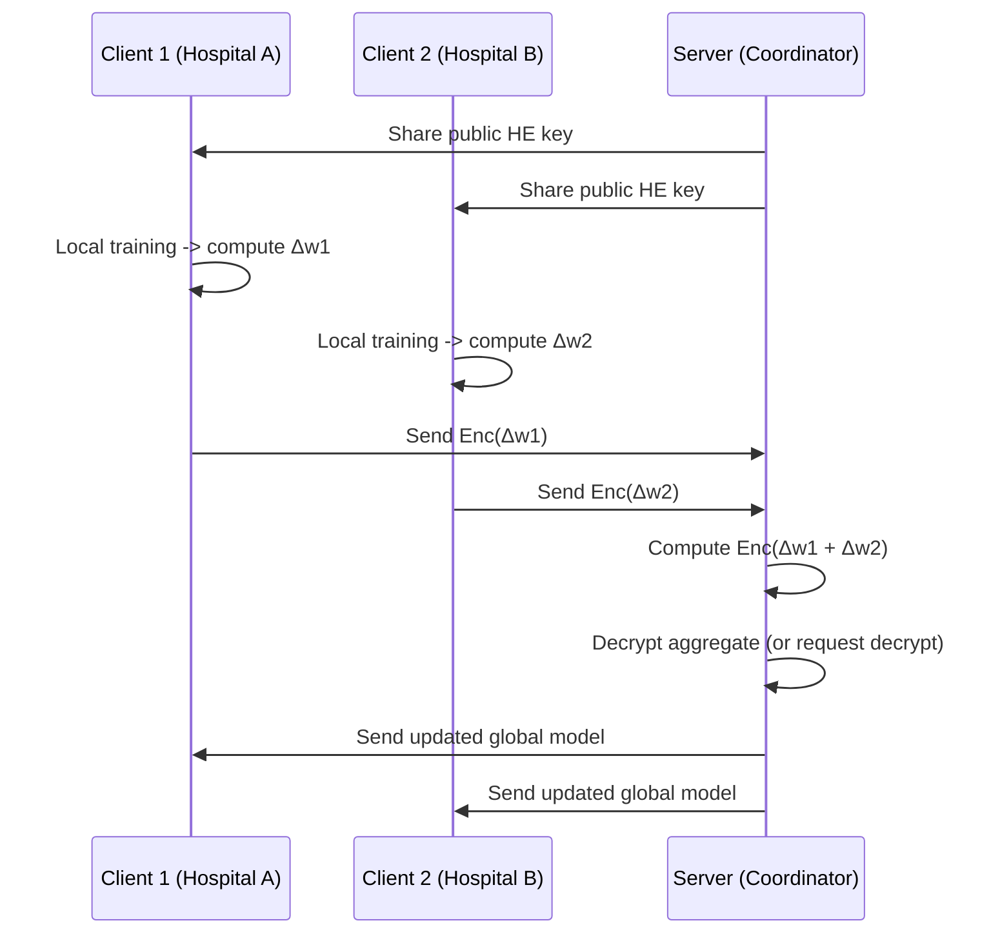

# MedSecureFL — Comprehensive Beginner's Guide

## Preface

This document provides a comprehensive, step‑by‑step explanation of the MedSecureFL repository. It is intended for researchers, graduate students, and practitioners who are new to federated learning (FL), homomorphic encryption (HE), and their intersection in privacy‑preserving medical image analysis. The guide explains core concepts, the repository's architecture, implementation details, and practical examples for experimentation. Every important file or function in the repository is described, and pragmatic tips and troubleshooting guidance are provided.

---

# Table of Contents

1. Fundamental Concepts (FL, HE, SMPC)
2. High‑level Design and Threat Model
3. Repository Walkthrough (file‑by‑file; function‑by‑function)
4. End‑to‑End Workflow — diagrams and worked examples
5. Data Preparation & Medical Image Considerations
6. Encryption Parameters, Keys, and Practical Tradeoffs
7. Running the Code: Installation, Docker, and Notebooks
8. Performance Profiling and Limitations
9. Extending MedSecureFL: Research and Engineering Paths
10. Troubleshooting, FAQs, and Common Pitfalls
11. Glossary of Terms
12. References and Recommended Reading

---

# 1. Fundamental Concepts (Concise, Formal)

## 1.1 Federated Learning (FL)

Federated learning is a distributed optimization paradigm in which multiple clients compute local model updates on local data and a central aggregator (server or coordinator) combines those updates into a global model. FL reduces centralization of raw data—an essential property for privacy‑sensitive domains.

Mathematically, the classical algorithm FedAvg iterates:

[ w_{t+1} = \sum_{k=1}^{K} \frac{n_k}{n} w_t^{(k)} ]

where (w_t^{(k)}) are client weights or updates, (n_k) is local sample count, and (n = \sum_k n_k).

## 1.2 Homomorphic Encryption (HE)

Homomorphic encryption is a class of cryptographic schemes that permit evaluation of certain algebraic functions over ciphertexts such that, after decryption, the result matches the plaintext operation. HE enables aggregation of encrypted updates without revealing their plaintext values.

* **Partial HE**: supports limited operations (e.g., additive homomorphism). Example: Paillier.
* **Leveled or Fully HE**: supports multiple multiplications but at higher computational cost.

In practice, many applied systems use additive HE + secure aggregation or combine HE with SMPC to balance complexity and utility.

## 1.3 Secure Multi‑Party Computation (SMPC)

SMPC protocols split data into shares distributed to multiple parties. No single party can reconstruct another party's data alone. Combined with HE, SMPC can strengthen safeguards against inference or collusion.

---

# 2. High‑level Design and Threat Model

## 2.1 Objective

Enable collaborative training of deep learning models for medical image analysis while preventing leakage of raw patient data and reducing the risk of model‑update inversion attacks.

## 2.2 Assumptions

* Honest‑but‑curious server: the central aggregator follows the protocol but may attempt to learn client data from received updates.
* Clients do not collude to reveal another client's data.
* Adversaries are constrained to polynomial resources (standard cryptographic assumptions).

## 2.3 Attacker Goals Addressed

* Model inversion attacks on gradients/weights.
* Data leakage via plain model updates during aggregation.

## 2.4 Residual Risks Not Addressed Directly

* Label leakage via side channels.
* Client collusion beyond threat model.
* Malicious updates (Byzantine clients) — detection and robust aggregation are extensions.

---

# 3. Repository Walkthrough (File‑by‑File)

> The repository is concise. The key files are described below with their responsibilities and implementation details.

```
MedSecureFL/
├── Encrypted FL Main-Rel.ipynb     # Notebook orchestrating the pipeline
├── FLPyfhelin.py                   # Homomorphic encryption utilities and wrappers
├── README.md                       # Minimal project overview
├── Dockerfile                      # Docker build for reproducible environment
├── DOCKER_RUN.md                   # Instructions to build/run Docker image
├── agg_model.hdf5                  # Serialized aggregated model weights (example)
├── main_model.hdf5                 # Serialized initial/main model weights (example)
├── plainweights.pickle             # Plaintext weights snapshot
├── publickey.pickle                # Pickled public HE key
├── privatekey.pickle               # Pickled private HE key (sensitive)
└── requirements.txt (if present)   # Optional dependency listing
```

## 3.1 `Encrypted FL Main-Rel.ipynb`

This Jupyter notebook contains the experimental pipeline. Typical sections in the notebook include:

1. Environment checks & dependency installation (e.g., Pyfhel==2.3.1).
2. Key generation and saving/loading keys.
3. Data ingestion or synthetic data generation for demonstration.
4. Local model definition and training loop using plain or encrypted data.
5. Encryption of model updates and preparation for aggregation.
6. Secure aggregation via homomorphic addition and optional decryption.
7. Evaluation of the aggregated model.

**Important notebook cells** to inspect and adapt:

* Key generation cell: generates Pyfhel context and key pair; be aware of parameter names that changed between library versions.
* Encryption/decryption cell: verifies correctness with small vectors before encrypting model parameters.
* Training cell: may simulate multiple clients sequentially in a single process (common for prototype / demonstration).

## 3.2 `FLPyfhelin.py`

This module encapsulates reusable HE operations. Typical function signatures and responsibilities:

* `def create_pyfhel_context(params) -> Pyfhel`: create an HE context and initialize keys.
* `def save_keys(HE, public_path, private_path)`: serialize keys to disk.
* `def load_keys(public_path, private_path) -> Pyfhel`: load keys back into memory.
* `def encrypt_vector(HE, vector) -> PyCtxt`: encrypt a 1D NumPy array or list.
* `def decrypt_vector(HE, ctxt) -> np.ndarray`: decrypt ciphertext to plaintext array.
* `def homomorphic_add(ctxt1, ctxt2) -> PyCtxt`: add two ciphertexts.

**Implementation notes**:

* Pyfhel v2.x uses parameter names and key APIs that differ from v3.x; the module therefore includes compatibility workarounds or explicit version checks.
* Flattening: model weights are flattened before encryption to permit element‑wise operations or packing.

## 3.3 Key/weights files

* `publickey.pickle` and `privatekey.pickle` are example key files. The private key should never be shared publicly. In a real deployment, the private key remains with a trusted party or is split across parties using threshold cryptography.
* `agg_model.hdf5` contains example aggregated weights; useful for quick evaluation without running full training.

## 3.4 Docker and reproducibility

* `Dockerfile` contains instructions to build a container with exact dependency versions. Use `DOCKER_RUN.md` for build and run commands. This helps avoid HS (host system) dependency mismatch, especially for cryptographic libraries.

---

# 4. End‑to‑End Workflow — Diagrams and Worked Examples

Below is an explicit, step‑wise flow with accompanying diagrams and sample code snippets that show the data/mathematical flow from local training to secure aggregation.

## 4.1 End‑to‑End Sequence (Narrative)

1. Each hospital loads its local dataset and defines a local copy of the model.
2. The central coordinator establishes the HE context and distributes the public key to clients.
3. Each client trains locally for several epochs on plaintext local data.
4. After local training, the client computes the update vector (e.g., delta weights) and encrypts it with the coordinator's public key.
5. The client sends the encrypted update to the coordinator.
6. The coordinator homomorphically adds received ciphertexts to compute an encrypted aggregate.
7. The coordinator, or a trusted party, performs decryption of the aggregate to obtain the plaintext aggregated update, which updates the global model.
8. The updated global model weights are redistributed to clients for the next round.

## 4.2 Mermaid Sequence Diagram



## 4.3 Concrete Example (Numerical Toy)

* Suppose two clients produce weight deltas: Δw1 = [0.5, -0.2], Δw2 = [0.1, 0.3].
* Using additive HE, the server receives Enc(Δw1) and Enc(Δw2), computes Enc(Δw1 + Δw2) = Enc([0.6, 0.1]).
* After decryption, server obtains [0.6, 0.1] and updates the model accordingly.

**Python toy snippet (pseudocode)**:

```python
# Assume HE context and keys established
ct1 = HE.encrypt(np.array([0.5, -0.2]))
ct2 = HE.encrypt(np.array([0.1, 0.3]))
ct_sum = ct1 + ct2  # homomorphic add
plaintext_sum = HE.decrypt(ct_sum)  # yields [0.6, 0.1]
```

---

# 5. Data Preparation & Medical Image Considerations

## 5.1 Input formats

Medical images typically exist as DICOM, NIfTI, or standard image formats (PNG, JPEG for exported slices). For research on brain MRI segmentation, input commonly is a 3D volume (T1/T2/FLAIR sequences) stored in NIfTI.

**Recommendations**:

* Convert 3D volumes to 2D slices if using 2D CNNs; use careful slice selection to avoid label leakage.
* Standardize intensity values (z‑score normalization) per volume.
* Use data augmentation that respects medical constraints (no horizontal flipping for lateralized conditions unless clinically justified).

## 5.2 Preprocessing pipeline (example)

1. Read raw file (e.g., using `pydicom` or `nibabel`).
2. Resample to consistent spacing.
3. Crop or pad to a fixed image size (e.g., 224×224) if using 2D networks.
4. Intensity normalization.
5. Convert to NumPy arrays and persist locally (encrypted storage optional).

## 5.3 Data split and non‑IID concerns

FL commonly operates under non‑IID data distributions. Document per‑client distributions and, when possible, simulate real heterogeneity (e.g., different class prevalences across hospitals) to evaluate robustness.

---

# 6. Encryption Parameters, Keys, and Practical Tradeoffs

## 6.1 Typical Pyfhel parameters (conceptual)

* Modulus size (defines plaintext space and security level).
* `m` or `n` parameter (ring dimension) — changed between Pyfhel versions.
* Scaling factors for fixed‑point representation of real numbers.

**Important**: Smaller parameters may degrade security; larger parameters increase computation and ciphertext size.

## 6.2 Packing and vectorization

Many HE libraries permit packing multiple scalar values into a single ciphertext. Packing reduces communication but requires careful alignment and operations that are compatible with packed representations.

## 6.3 Practical tradeoffs

* Security vs latency: stronger encryption increases runtime.
* Precision vs ciphertext growth: representing floats as fixed‑point integers requires scaling (e.g., multiply by 1e4 and round).
* Computation load at the server: homomorphic operations are often 10×–100× slower than plaintext arithmetic.

---

# 7. Running the Code: Installation, Docker, and Notebooks

## 7.1 Docker (recommended for reproducibility)

1. Build image: `docker build -t medsecurefl:latest .`
2. Run container: `docker run --rm -it -p 8888:8888 medsecurefl:latest`
3. Inside container: `jupyter notebook --ip=0.0.0.0 --no-browser --allow-root`

## 7.2 Direct setup (host system)

1. Create virtual environment: `python -m venv venv && source venv/bin/activate`
2. Install dependencies: `pip install -r requirements.txt` (or `pip install Pyfhel==2.3.1` and `tensorflow==...` as needed)
3. Launch notebook: `jupyter notebook Encrypted\ FL\ Main-Rel.ipynb`

## 7.3 Safety note about private keys

Do not commit private key files into public repositories. If you find `privatekey.pickle` in the repo, remove it and re‑generate the keys in a secure environment.

---

# 8. Performance Profiling and Limitations

## 8.1 Sources of overhead

* Homomorphic encryption and decryption per vector.
* Increased payload sizes for ciphertexts.
* Serialization/deserialization of ciphertext objects.

## 8.2 Benchmark experiments to run

* Wall time of encryption for a single model weight vector (record for different layer sizes).
* Size of ciphertexts for a layer (bytes), and communication cost per FL round.
* End‑to‑end training time over R rounds vs. baseline central training.

## 8.3 Suggested optimizations

* Encrypt only sensitive parts of the model (e.g., final layers) or gradients—use hybrid approaches.
* Use packing to reduce the number of ciphertexts.
* Apply update sparsification or quantization to reduce communication.

---

# 9. Extending MedSecureFL: Research & Engineering Paths

## 9.1 Research directions

* Integrate differential privacy (DP) with HE to formalize privacy budgets.
* Investigate robust aggregation to handle malicious clients (Byzantine resilience).
* Compare HE‑based aggregation with secure aggregation protocols (secret sharing, threshold HE).

## 9.2 Engineering improvements

* Provide dataset loader modules (DICOM/NIfTI support) and data augmentation pipelines.
* Modularize FL orchestration to allow plug‑in of arbitrary models (PyTorch/TensorFlow) and custom aggregators.
* Add experiment tracking (e.g., Weights & Biases, TensorBoard) and performance logging.

---

# 10. Troubleshooting, FAQs, and Common Pitfalls

### Q1: "Key generation fails with Pyfhel v3.x" — What to do?

**A**: Install the compatible version used by the code: `pip install Pyfhel==2.3.1`. Alternatively, update `FLPyfhelin.py` to match the v3.x API (adjust parameter names and calls).

### Q2: "Decryption returns incorrect values (precision error)"

**A**: Confirm fixed‑point scaling factors used during encryption and decryption. Ensure the same scaling factor is applied when converting floats to integers and back.

### Q3: "Very slow training" — mitigation steps

**A**: Profile to identify hotspots. Use smaller model for baseline; limit encryption to small vector subsets; reduce number of encrypted rounds for benchmarking.

### Q4: "Private key accidentally committed"

**A**: Revoke the key pair if used in production, remove from repo, and rotate keys. Use `git filter-branch` or `git filter-repo` to purge history.

---

# 11. Glossary of Terms

* **Ciphertext**: Encrypted data that cannot be read without decryption.
* **Plaintext**: Original unencrypted data.
* **FedAvg**: Federated Averaging algorithm for aggregation of client updates.
* **HE**: Homomorphic Encryption.
* **SMPC**: Secure Multi‑Party Computation.
* **Packing**: Technique to put multiple values in a single ciphertext.

---

# 12. References and Recommended Reading

1. McMahan, H. B., et al. "Communication-Efficient Learning of Deep Networks from Decentralized Data." AISTATS 2017. (FedAvg paper)
2. Acar, A., et al. "A Survey on Homomorphic Encryption for Machine Learning." ACM Computing Surveys, 2018.
3. Bonawitz, K., et al. "Practical Secure Aggregation for Federated Learning on User‑Held Data." CCS 2017.
4. Pyfhel Documentation (match the version used in the repository).

---

# Appendix A: Example `FLPyfhelin.py` API Reference (Hypothetical)

```python
class HEManager:
    def __init__(self, params=None):
        """Create Pyfhel context and keys."""

    def save_keys(self, pub_path, priv_path):
        """Serialize keys to disk."""

    def load_keys(self, pub_path, priv_path):
        """Restore context and keys from disk."""

    def encrypt_weights(self, weight_vector):
        """Encrypt flattened NumPy vector and return ciphertext."""

    def decrypt_weights(self, ciphertext):
        """Decrypt ciphertext to NumPy vector."""
```

---

# Final Notes

This document is intentionally thorough to serve both as a teaching resource and as a practical engineering guide. If you wish, I can:

* Produce a condensed, printable `beginners_guide.md` tailored to novices (one‑page summary + diagrams).
* Generate a developer checklist and a prioritized backlog to convert MedSecureFL into a reproducible experimental framework for your MRI work.
* Convert this document into a GitHub README replacement and open a PR with suggested project reorganizations and `.gitignore`/security fixes.

Please indicate which of these follow‑up actions you prefer. If you would like direct edits to specific code files or a PR created, provide repository write access or permit me to generate patch files here for you to apply.
